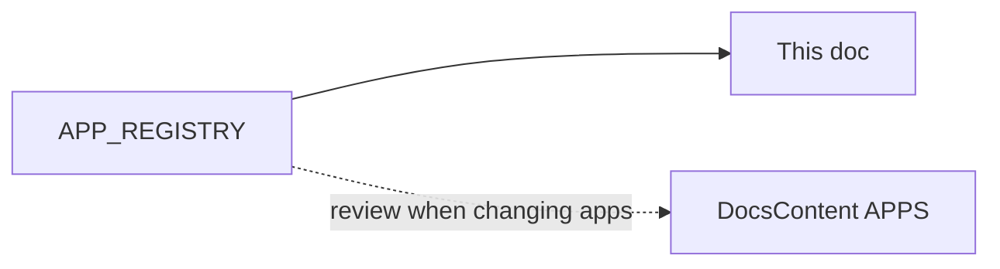

# Apps integration matrix

**Audience:** founder · **Arabic:** [integration-matrix.ar.md](integration-matrix.ar.md)

**Source of truth:** [`APP_REGISTRY`](../../src/lib/apps/registry.ts). When you add, remove, or change an app descriptor or `available` flag, update this table and audit [`DocsContent.tsx`](../../src/app/[locale]/docs/DocsContent.tsx) (`APPS` array) so customer-facing copy stays aligned. See also [extending-integrations.md](extending-integrations.md).

Only OAuth-capable integrations are listed in the marketplace. Non-OAuth plugins have been removed from the registry.

## Homepage integration marquee

The public homepage may show a broader ecosystem story than the authenticated Apps marketplace: Vercel, Clerk, Meta, WhatsApp, Instagram, Apple Pay, SkipCash, Zapier, Cloudflare, Mailchimp, Klaviyo, Aramex, Google Sheets, and other operational tools can appear as monochrome SVG logo chips. Keep these chips visual-only unless the provider has a real install/config flow in `APP_REGISTRY`.

Design rules for the marquee:

- Use real SVG marks where available, forced to one color through `currentColor`, mask, or filter.
- Use charcoal chips on cream surfaces or pale marks on the dark halftone hero.
- Avoid colored provider logos, blue SaaS gradients, and orange accent fills.
- Animate as continuous left/right rows, with a static readable fallback for reduced motion.

**Surfaces** (shorthand):

- **Storefront** — buyer-facing site (scripts, islands, blocks).
- **Builder** — `/account/builder` only.
- **API** — `src/app/api/apps/<id>/...` or similar.
- **Server** — webhooks, background writes, domain tooling (no buyer DOM).
- **Dashboard** — settings UI under `/account/apps`, `/account/settings`, etc.

## Available today (`available: true`)

No OAuth integrations are marked available until their real provider OAuth flow is implemented end-to-end.

## Coming soon (`available: false`)

Listed in registry order; OAuth env keys live on descriptors — see registry for `requiredEnv` and OAuth URLs.

| id | Name | Category | authKind |
|----|------|----------|----------|
| mailchimp | Mailchimp | marketing | oauth |
| klaviyo | Klaviyo | marketing | oauth |
| whatsapp-business | WhatsApp Business | sales | oauth |
| instagram-shop | Instagram Shop | sales | oauth |
| tap-payments | Tap Payments | finance | oauth |

## Removed non-OAuth entries

Removed from the marketplace registry: Tabby, Postpay, Currency Converter, Giphy, TikTok Pixel, Zapier, Notion, Google Sheets export, Crisp live chat, Intercom, HubSpot, Drop manager, Mawid, Taqim, Press kit / Lookbook, Bilingual SEO Assistant, Aramex shipping, Cloudflare DNS, Google Analytics 4, Meta Pixel, and Fawran.

## Maintenance diagram

